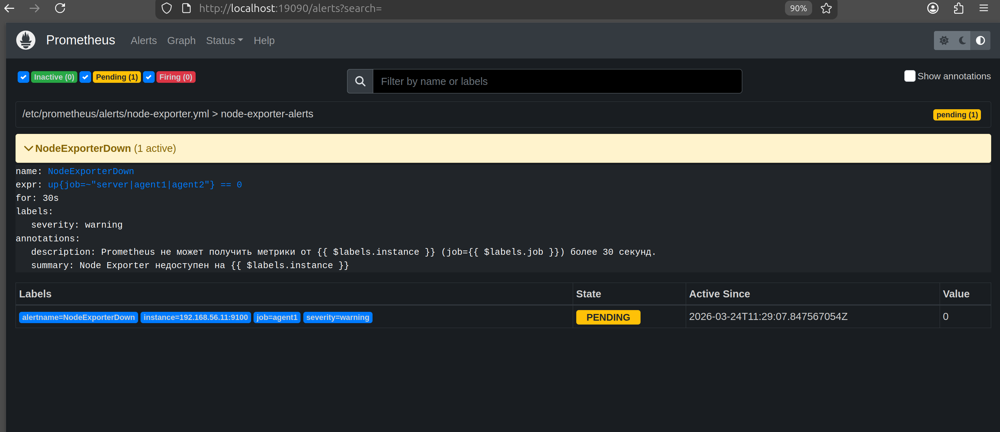
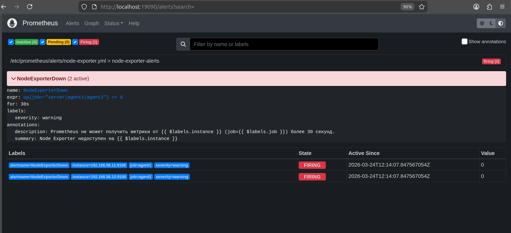
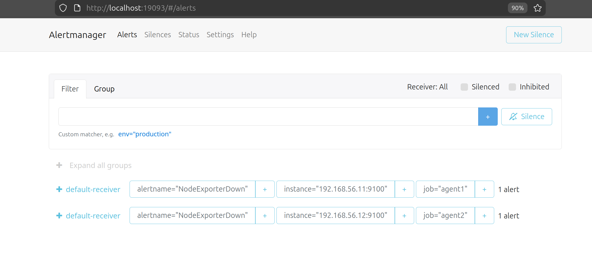
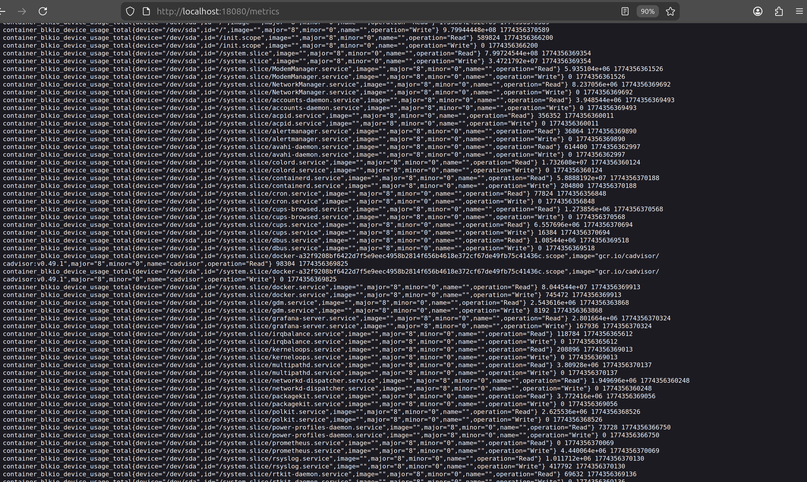
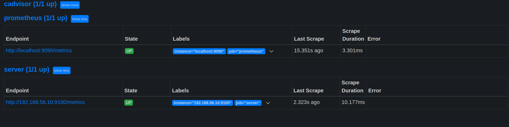
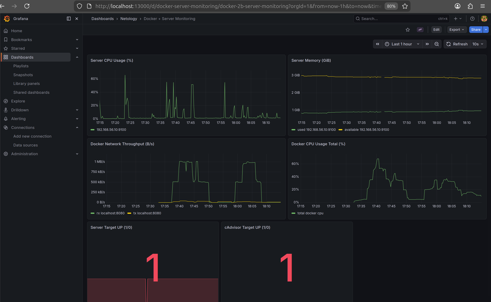

# ДЗ №2 (отдельная сдача): Prometheus Alerting

## Задание 1

Создать правило оповещения и подключить его в конфиг Prometheus.

### Что добавлено в проект

- Файл правила: `configs/prometheus/node-exporter-alerts.yml`
- Подключение правил в `prometheus.yml` через:

```yaml
rule_files:
  - /etc/prometheus/alerts/*.yml
```

- Копирование файла правила при провижининге `server`:
  - из `configs/prometheus/node-exporter-alerts.yml`
  - в `/etc/prometheus/alerts/node-exporter.yml`

## Применение изменений

```bash
vagrant provision server
```

## Проверка конфига

```bash
vagrant ssh server -c "sudo promtool check config /etc/prometheus/prometheus.yml"
```

Ожидаемый результат: `SUCCESS` и найденный rule file.

## Как получить статус Pending для скриншота

1. Остановить `node_exporter` на одном из агентов:

```bash
vagrant ssh agent1 -c "sudo systemctl stop node_exporter"
```

2. Открыть страницу алертов Prometheus:

`http://localhost:19090/alerts`

3. Сделать скриншот, пока алерт `NodeExporterDown` имеет статус `Pending`  
   (до перехода в `Firing`, примерно первые 30 секунд).

4. После скриншота вернуть сервис:

```bash
vagrant ssh agent1 -c "sudo systemctl start node_exporter"
```

## Что должно на скриншоте

- Страница `Prometheus -> Alerts`
- Алерт `NodeExporterDown`
- Состояние: `Pending`
- Инстанс недоступного таргета (например, `192.168.56.11:9100`)



## Задание 2

Установить `Alertmanager` и интегрировать его с `Prometheus`.

### Что добавлено в проект

- Конфиг Alertmanager: `configs/alertmanager/alertmanager.yml`
- Установка `alertmanager` и `amtool` в `scripts/server-setup.sh`
- systemd unit: `alertmanager.service`
- Интеграция в Prometheus через блок:

```yaml
alerting:
  alertmanagers:
    - static_configs:
        - targets: ['localhost:9093']
```

- Проброс порта в `Vagrantfile`: `19093 -> 9093`

## Применение изменений

```bash
vagrant reload server
vagrant provision server
```

## Проверка сервисов

```bash
vagrant ssh server -c "sudo systemctl is-active prometheus alertmanager"
```

Ожидаемый результат: оба сервиса в статусе `active`.

## Получение алерта в статусе Firing

1. Остановить `node_exporter` на `agent1`:

```bash
vagrant ssh agent1 -c "sudo systemctl stop node_exporter"
```

2. Подождать больше 30 секунд (в правиле есть `for: 30s`).

3. Открыть `Prometheus Alerts`:

`http://localhost:19090/alerts`

4. Сделать скриншот, где `NodeExporterDown` в статусе `Firing`.

5. Открыть `Alertmanager`:

`http://localhost:19093`

6. Сделать скриншот, где видно активное оповещение `NodeExporterDown`.

7. Вернуть сервис:

```bash
vagrant ssh agent1 -c "sudo systemctl start node_exporter"
```

## Скриншоты (Задание 2)




## Задание 3

Активировать экспортёр метрик в Docker и подключить его к `Prometheus`.

### Что добавлено в проект

- Установка `docker.io` в `scripts/server-setup.sh`
- Запуск экспортёра `cAdvisor` в контейнере Docker
- Новый таргет в `prometheus.yml`:

```yaml
- job_name: 'cadvisor'
  static_configs:
    - targets: ['localhost:8080']
```

- Проброс порта в `Vagrantfile`: `18080 -> 8080`

## Применение изменений

```bash
vagrant reload server
vagrant provision server
```

## Проверка эндпоинта экспортёра

Открыть в браузере:

`http://localhost:18080/metrics`

Сделать скриншот страницы с метриками.

## Проверка таргета в Prometheus

Открыть в браузере:

`http://localhost:19090/targets`

Убедиться, что таргет `cadvisor` в статусе `UP`, и сделать скриншот.

## Скриншоты (Задание 3)




## Задание 4* (со звездочкой)

Создать свой дашборд Grafana с метриками Docker и сервера.

### Что добавлено в проект

- Provisioning дашбордов Grafana:
  - `configs/grafana/dashboard-provisioning.yml`
- Готовый кастомный дашборд:
  - `configs/grafana/dashboards/docker-server-dashboard.json`
- Автокопирование файлов и подключение при `provision` в `scripts/server-setup.sh`

Дашборд: `Docker + Server Monitoring`  
UID: `docker-server-monitoring`  
Папка: `Netology`

### Какие метрики на дашборде

- загрузка CPU сервера (`node_exporter`);
- память сервера (`MemAvailable` и `MemTotal`);
- сетевой трафик контейнеров Docker (`cAdvisor`);
- суммарная CPU-нагрузка контейнеров Docker (`cAdvisor`);
- статусы таргетов `server` и `cadvisor` (`up`).

## Применение изменений

```bash
vagrant provision server
```

## Где смотреть дашборд

1. Открыть Grafana: `http://localhost:13000`
2. Перейти в `Dashboards` -> папка `Netology`
3. Открыть дашборд `Docker + Server Monitoring`

## Скриншот для сдачи

Приложить скриншот открытого дашборда, где видно несколько панелей с метриками Docker и сервера.


