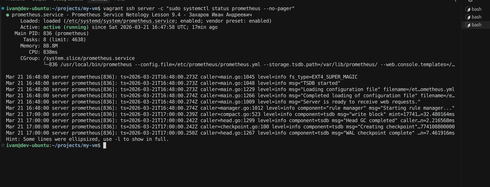
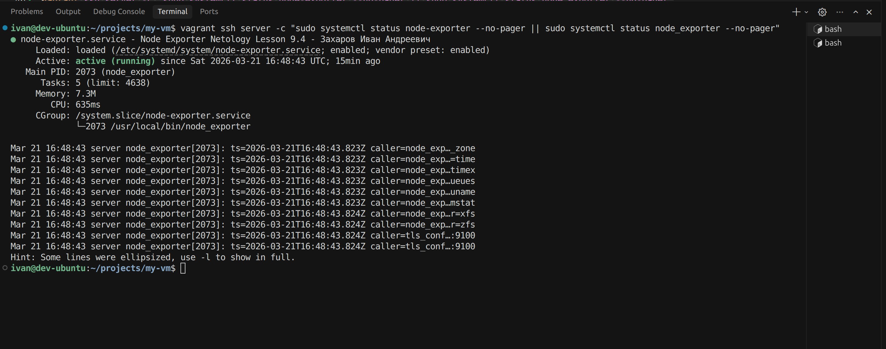
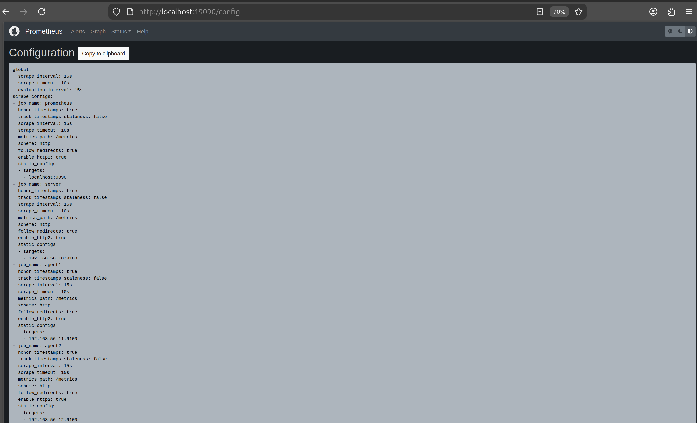
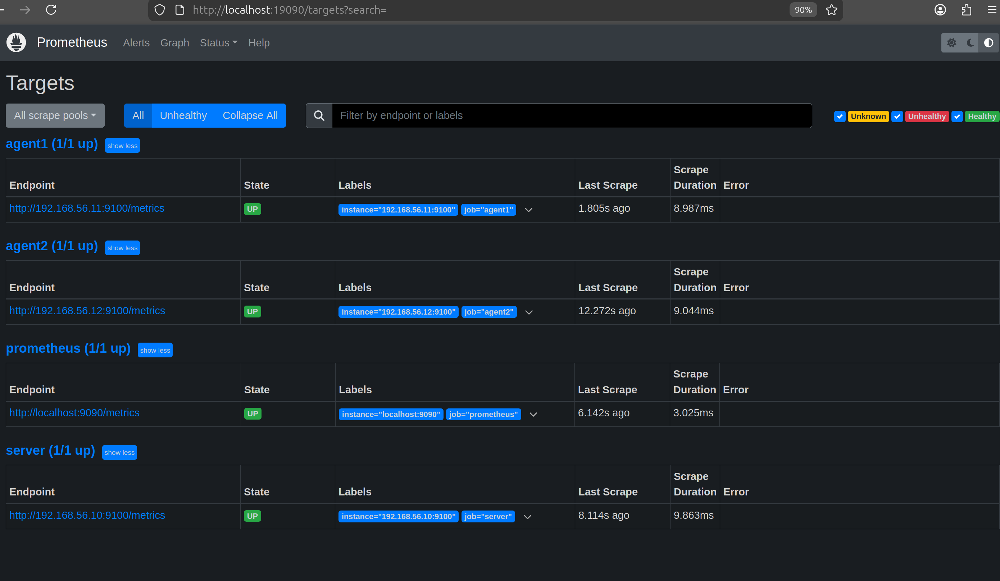
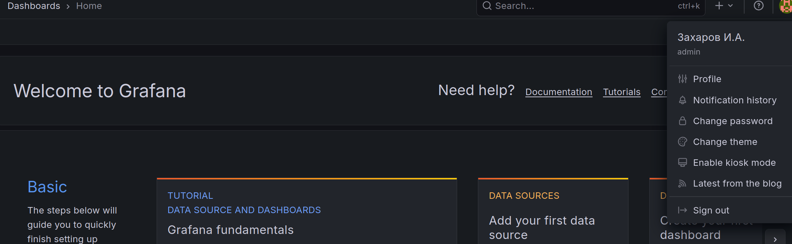
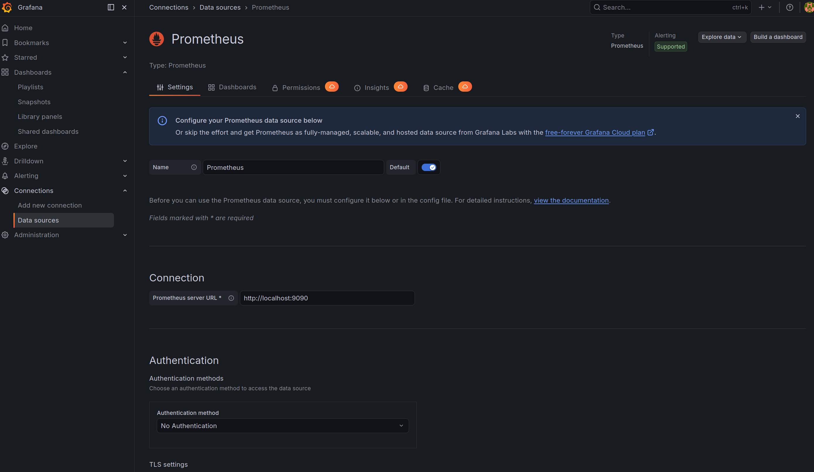

# My VM Monitoring Stack

Проект поднимает 3 виртуальные машины через Vagrant:

- `server` - Prometheus + Grafana + Node Exporter
- `agent1` - Node Exporter
- `agent2` - Node Exporter

## ДЗ №1 (Netology 9.4)

Ниже оформление результата для трёх заданий. 

```bash
vagrant ssh server -c '
FIO="Захаров Иван Андреевич";
sudo sed -i "s/^Description=.*/Description=Prometheus Service Netology Lesson 9.4 - ${FIO}/" /etc/systemd/system/prometheus.service;
sudo sed -i "s/^Description=.*/Description=Node Exporter Netology Lesson 9.4 - ${FIO}/" /etc/systemd/system/node_exporter.service;
sudo systemctl daemon-reload;
sudo systemctl enable --now node_exporter
'
```

### Задание 1. Установка Prometheus

Проверка сервиса на `server`:

```bash
vagrant ssh server -c "sudo systemctl status prometheus --no-pager"
```

На скриншоте должно быть видно строку:

`prometheus.service - Prometheus Service Netology Lesson 9.4 - ФИО`

Скриншот:



### Задание 2. Установка Node Exporter

Проверка сервиса на `server`:

```bash
vagrant ssh server -c "sudo systemctl status node_exporter --no-pager"
```

На скриншоте должно быть видно строку:

`node_exporter.service - Node Exporter Netology Lesson 9.4 - ФИО`

Скриншот:



### Задание 3. Подключение Node Exporter к Prometheus

Открой Prometheus в браузере:

`http://localhost:19090`

Сделай и приложи два скриншота:

1. `Status -> Configuration` (виден конфиг с добавленным `node_exporter`).
2. `Status -> Targets` (видно минимум два endpoint'а в состоянии `UP`).

Скриншоты:




### Задание 4*. Установка Grafana

Открой Grafana в браузере:

`http://localhost:13000`

Быстро выставить ФИО в профиле:

1. Войти под `admin/admin` (если попросит - сменить пароль).
2. Нажать на аватар в левом нижнем углу -> `Profile`.
3. В поле `Name` указать свои ФИО и сохранить (`Save profile`).

Требование к скриншоту:

- левый нижний угол интерфейса Grafana;
- при наведении на иконку пользователя должны быть видны твои ФИО.

Скриншот:



### Задание 5*. Интеграция Grafana и Prometheus

Источник данных Prometheus подключается автоматически после:

```bash
vagrant provision server
```

Что настроено автоматически:

- datasource `Prometheus` в Grafana;
- URL источника: `http://localhost:9090`;
- источник помечен как `default`.

Ручная проверка в интерфейсе Grafana:

1. Открой `http://localhost:13000`.
2. Перейди `Connections -> Data sources`.
3. Открой `Prometheus` и нажми `Save & test`.
4. Убедись, что есть сообщение `Data source is working`.

Проверка интеграции:

- создай тестовый дашборд (`Dashboards -> New -> New dashboard`);
- добавь панель с запросом `up`;
- в предпросмотре должны появиться метрики с таргетов Prometheus.

Скриншот:




## Быстрый старт

1. Поднять окружение:

```bash
vagrant up
```

2. Проверить статус:

```bash
vagrant status
```

3. Если конфиг менялся (например, порты), перезапустить `server`:

```bash
vagrant reload server
```

## Доступ из браузера (с хоста)

Используй адреса хоста, а не внутренний IP VM:

- Prometheus: `http://localhost:19090`
- Grafana: `http://localhost:13000`

Логин Grafana по умолчанию: `admin/admin`.

## Полезные команды

```bash
vagrant ssh server
vagrant ssh agent1
vagrant ssh agent2
```

Проброшенные SSH-порты:

- `server` -> `22220`
- `agent1` -> `22221`
- `agent2` -> `22222`

## Troubleshooting

- **Не открывается `192.168.56.10` в браузере**  
  Открывай через проброшенные порты хоста:
  - `http://localhost:19090`
  - `http://localhost:13000`

- **`vagrant ssh server` не подключается**  
  Проверь, что VM в статусе `running`:
  ```bash
  vagrant status
  ```
  Перезапусти VM:
  ```bash
  vagrant reload server
  ```

- **Сервисы внутри `server` не поднялись**  
  Зайди в VM и проверь статусы:
  ```bash
  vagrant ssh server -c "systemctl is-active prometheus grafana-server node_exporter"
  ```
  Если нужно, запусти провижининг повторно:
  ```bash
  vagrant provision server
  ```

- **Проблемы после изменения `Vagrantfile`**  
  Примени изменения перезапуском нужной VM:
  ```bash
  vagrant reload server
  ```
